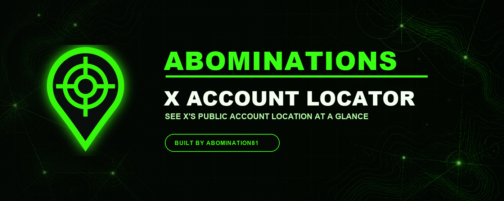

# Abominations X Account Locator

**Built by [Abomination81](https://github.com/Abomination81).**

Abominations X Account Locator places X's public **Account based in** disclosure directly on ordinary and quoted posts. The badge color is customizable and defaults to Abomination green (`#39ff14`). Version 0.7 excludes the signed-in account from location lookups and badges, and gives `@Abomination81` the extension-only custom location `XANADU` for everyone else.



## Install in Chrome

The easiest instructions and download are on the public installation page:

**[Open the installation guide](https://abomination81.github.io/abominations-x-account-locator/)**

Quick version:

1. Download and unzip `abominations-x-account-locator-v0.7.0.zip` from the installation page.
2. Open `chrome://extensions` in Chrome.
3. Turn on **Developer mode** in the upper-right corner.
4. Click **Load unpacked**.
5. Select the unzipped `Abominations-X-Account-Locator` folder.
6. Open or refresh [x.com](https://x.com/) while signed in.

Keep the unzipped folder on your computer after installation. Chrome loads the extension from that folder.

## Features

- Shows X's public account-location label while you scroll.
- Supports ordinary posts and quoted posts.
- Does not request or display the signed-in account's own location.
- Displays `XANADU` for `@Abomination81` as a transparent extension-only custom label.
- Abbreviates `United States` to `USA`, `North America` to `N. America`, and `United Kingdom` to `UK`.
- Lets you choose any badge color, defaulting to Abomination green.
- Caches results locally for faster scrolling.
- Includes a pause switch, status display, and clear-cache button.


## Important context

X says its account-location field is inferred from aggregated IP addresses. It may be inaccurate and is not proof of nationality, identity, physical presence, or who controls an account.

The extension has no developer-operated server, advertising, analytics, or data brokerage. It communicates with X and X's asset domain through the user's existing X session to retrieve X's own public account-location result. Settings and the bounded lookup cache remain in Chrome's local extension storage.

## Updating

Download and unzip the newest package, replace the old extension folder, open `chrome://extensions`, and click **Reload** on the extension card. Then refresh open X tabs.

## Test

```sh
node --test tests/*.test.js
```

This project is independent and is not affiliated with X Corp. Manual installation is provided because the extension is not distributed through the Chrome Web Store.
